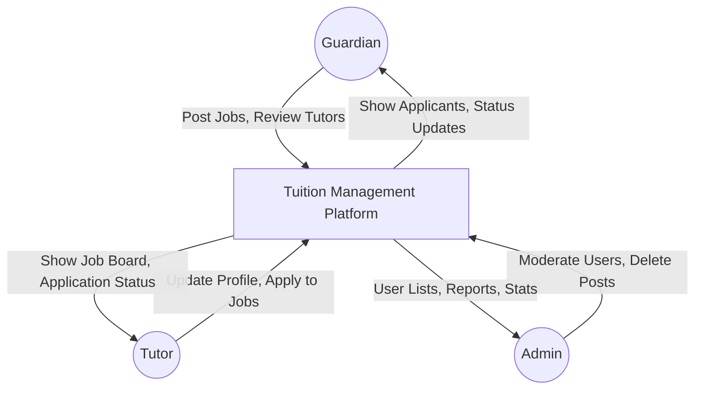
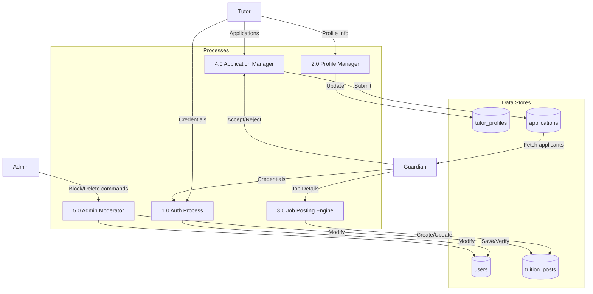

# Tuition Management Platform - Data Flow Diagram (DFD)

## Level 0 DFD (Context Diagram)
The Level 0 DFD shows the boundaries of the Tuition Management Platform and its interactions with external entities.

## Level 1 DFD (Process Level Diagram)
The Level 1 DFD breaks down the main processes of the platform: Authentication, Profile Management, Job Posting, Application Flow, and Admin Moderation.

