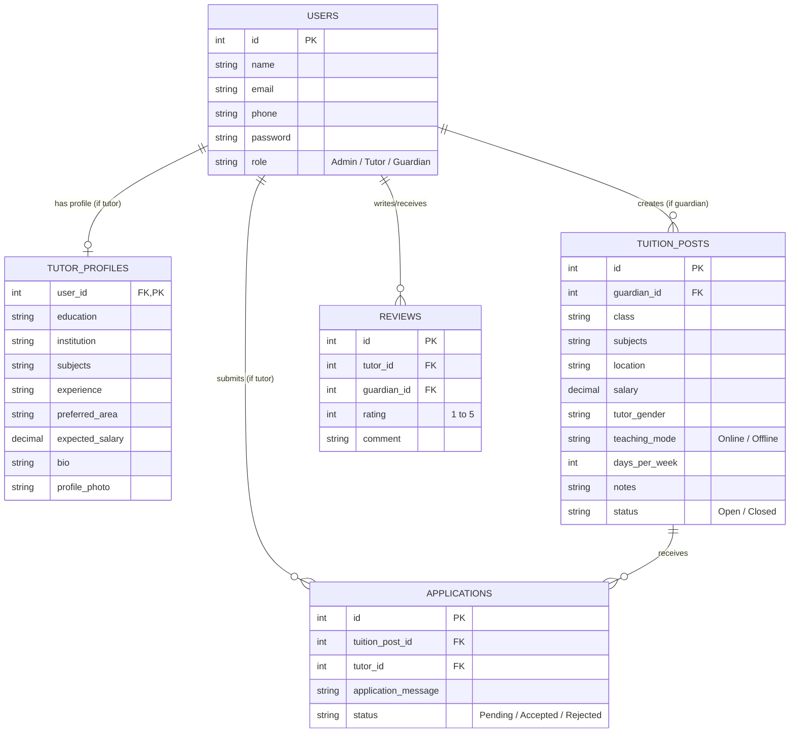

# Tuition Management Platform - Entity Relationship Diagram (ERD)

The ERD shows the relationships between users, profiles, posts, applications, and reviews.

```mermaid
erDiagram
    USERS ||--o| TUTOR_PROFILES : "has profile (if tutor)"
    USERS ||--o{ TUITION_POSTS : "creates (if guardian)"
    USERS ||--o{ APPLICATIONS : "submits (if tutor)"
    TUITION_POSTS ||--o{ APPLICATIONS : "receives"
    USERS ||--o{ REVIEWS : "writes/receives"

    USERS {
        int id PK
        string name
        string email
        string phone
        string password
        string role "Admin / Tutor / Guardian"
    }

    TUTOR_PROFILES {
        int user_id FK,PK
        string education
        string institution
        string subjects
        string experience
        string preferred_area
        decimal expected_salary
        string bio
        string profile_photo
    }

    TUITION_POSTS {
        int id PK
        int guardian_id FK
        string class
        string subjects
        string location
        decimal salary
        string tutor_gender
        string teaching_mode "Online / Offline"
        int days_per_week
        string notes
        string status "Open / Closed"
    }

    APPLICATIONS {
        int id PK
        int tuition_post_id FK
        int tutor_id FK
        string application_message
        string status "Pending / Accepted / Rejected"
    }

    REVIEWS {
        int id PK
        int tutor_id FK
        int guardian_id FK
        int rating "1 to 5"
        string comment
    }
```
